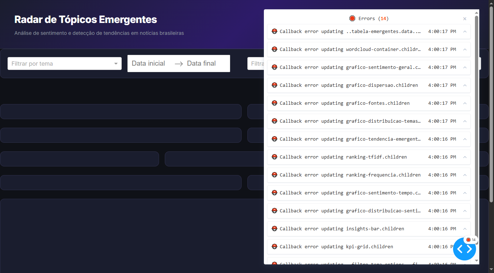

# Radar de Tópicos Emergentes + Sentimento com Airflow



> Dashboard moderno com tema escuro, 6 KPIs, 8 gráficos interativos, wordcloud e tabela de tópicos emergentes.

Pipeline ETL que coleta notícias de portais brasileiros (G1, Folha, CNN Brasil), processa com NLP, analisa sentimento e detecta tópicos emergentes, tudo orquestrado pelo Apache Airflow e visualizado em um dashboard interativo com Dash.

## Arquitetura

```
                    ┌──────────────┐
                    │  Fontes RSS  │
                    │ G1 / Folha / │
                    │  CNN Brasil  │
                    └──────┬───────┘
                           │
                    ┌──────▼───────┐
                    │   Bronze     │  raw/news_raw_{data}.parquet
                    │  (Extract)   │
                    └──────┬───────┘
                           │
                    ┌──────▼───────┐
                    │   Silver     │  clean + dedup + sentiment
                    │ (Clean/Dedup │  + nlp_processing
                    │  /Sentiment) │  (Parquet intermediário)
                    └──────┬───────┘
                           │
                    ┌──────▼───────┐
                    │    Gold      │  daily_trending_topics.parquet
                    │ (Aggregate)  │  daily_overall_sentiment.parquet
                    └──────┬───────┘
                           │
                    ┌──────▼───────┐
                    │   Dashboard  │  Dash app lê dados Gold
                    │    (Dash)    │
                    └──────────────┘
```

### Fluxo da DAG

```
extract_rss_feeds
    → validate_raw_data
        → clean_and_normalize_text
            → remove_duplicates
                → compute_sentiment_scores
                    → tokenize_and_process
                        → compute_frequency_and_tfidf
                            → detect_emerging_topics
                                → aggregate_and_save_gold
                                    → refresh_dashboard_data
```

## Decisões de engenharia

### TF-IDF além de frequência simples
A frequência bruta favorece termos genéricos que aparecem em toda notícia. O TF-IDF pondera cada termo pela sua raridade no corpus do dia, destacando palavras realmente distintivas do momento. Existe um `corpus_minimo_tfidf` (default 5 notícias) porque TF-IDF em corpus muito pequeno produz scores instáveis e semanticamente pobres.

### Deduplicação por similaridade em vez de título exato
O mesmo evento (ex: "Copa do Mundo 2026") aparece com títulos ligeiramente diferentes em cada fonte. Comparar por similaridade cosseno com TF-IDF (threshold 0.75) captura essas variações. A notícia mais antiga é mantida e as duplicatas são marcadas com `duplicata_de` — nunca descartadas sem rastro.

### Z-score contra baseline histórico
Detectar "o que está bombando hoje" olhando só o topo do ranking do dia confunde termos consistentemente populares (ex: "governo") com picos reais. O z-score compara a frequência de hoje contra a média e desvio padrão da janela histórica (14 dias), destacando desvios significativos. Nos primeiros 14 dias de execução, `emergente` é marcado como `None` (não `False`) para não sugerir falsamente que nada é emergente.

### Escolha do pysentimiento para sentimento em português
`pysentimiento` usa um modelo transformer (BERT) fine-tuned especificamente para português, eliminando a necessidade de treinar ou traduzir. A interface é simples: `create_analyzer(task="sentiment", lang="pt")`. **Alternativa leve (documentada):** se o ambiente não suportar PyTorch (~2GB), um léxico de sentimento como SentiLex-PT pode ser usado como fallback — menos preciso, mas sem dependência pesada.

### Por que Dash (e não Streamlit)
Dash oferece maior controle de layout com callbacks reativos, ideal para múltiplos filtros interativos combinados (tema + período). Streamlit reexecuta o script inteiro a cada interação, o que seria ineficiente para ler múltiplos arquivos Parquet.

## Stack

| Componente | Tecnologia |
|---|---|
| Orquestração | Apache Airflow 2.10.5 |
| Coleta | feedparser |
| Processamento | pandas, nltk, scikit-learn |
| Sentimento | pysentimiento (BERT pt) |
| Armazenamento | Parquet (bronze/silver/gold) |
| Vizualização | Dash + Plotly + wordcloud (tema escuro, 8 gráficos) |
| Testes | pytest |
| Config | YAML |
| Containerização | Docker + docker-compose |
| CI/CD | GitHub Actions |

## Como rodar localmente

### Opção 1: Docker (recomendado)

```bash
docker compose up -d
```

- Airflow UI: http://localhost:8080 (admin/admin)
- Dashboard: http://localhost:8050

### Opção 2: Manual

#### 1. Pré-requisitos

- Python 3.10 ou 3.11
- Git

#### 2. Clonar e criar ambiente virtual

```bash
git clone <seu-repositorio> trending-topics-airflow
cd trending-topics-airflow
python -m venv venv
source venv/bin/activate   # Linux/Mac
# ou .\venv\Scripts\activate  # Windows
```

#### 3. Instalar Airflow (com constraints — obrigatório)

```bash
AIRFLOW_VERSION=2.10.5
PYTHON_VERSION="$(python --version | cut -d ' ' -f 2 | cut -d '.' -f 1-2)"
CONSTRAINT_URL="https://raw.githubusercontent.com/apache/airflow/constraints-${AIRFLOW_VERSION}/constraints-${PYTHON_VERSION}.txt"
pip install "apache-airflow==${AIRFLOW_VERSION}" --constraint "${CONSTRAINT_URL}"
```

#### 4. Instalar demais dependências

```bash
pip install -r requirements.txt
```

#### 5. Recursos NLTK

```python
import nltk
nltk.download('punkt')
nltk.download('stopwords')
```

#### 6. Configurar AIRFLOW_HOME

```bash
export AIRFLOW_HOME=$(pwd)
# ou no Windows (PowerShell): $env:AIRFLOW_HOME = (Get-Location).Path
```

#### 7. Inicializar e rodar Airflow

```bash
airflow standalone
```

A UI do Airflow estará disponível em `http://localhost:8080`.

A DAG `trending_topics_pipeline` aparecerá na interface. Acione-a manualmente para a primeira execução.

#### 8. Rodar o dashboard

```bash
python dashboard/app.py
```

O dashboard estará disponível em `http://localhost:8050`.

> Nota: a primeira execução da task de sentimento baixa o modelo pré-treinado (~400MB) — vai demorar e precisa de internet.

## Testes

```bash
pytest tests/ -v
```

## Estrutura de pastas

```
trending-topics-airflow/
├── dags/
│   └── trending_topics_pipeline.py
├── src/
│   ├── extract.py              # Coleta RSS → Bronze
│   ├── clean.py                # Limpeza e normalização
│   ├── deduplication.py        # Remoção de duplicatas por similaridade
│   ├── sentiment_analysis.py   # Análise de sentimento (pysentimiento)
│   ├── nlp_processing.py       # Tokenização, frequência, TF-IDF
│   ├── trend_detection.py      # Z-score e detecção de emergentes
│   └── aggregate.py            # Agregação final → Gold
├── dashboard/
│   ├── app.py                  # Dashboard em Dash
│   ├── assets/                 # Word clouds geradas
│   └── screenshots/            # Screenshots do dashboard
├── config/
│   └── config.yaml             # Parâmetros do pipeline
├── data/
│   ├── bronze/                 # Dados brutos (Parquet)
│   ├── silver/                 # Dados limpos (Parquet)
│   └── gold/                   # Dados agregados (Parquet)
├── tests/
│   ├── test_extract.py
│   ├── test_clean.py
│   ├── test_deduplication.py
│   ├── test_nlp_processing.py
│   ├── test_sentiment_analysis.py
│   ├── test_trend_detection.py
│   ├── test_aggregate.py
│   └── test_dag_validation.py
├── docker-compose.yml          # Orquestração Docker
├── Dockerfile                  # Imagem personalizada Airflow
├── pyproject.toml              # Configuração do projeto
├── .github/workflows/ci.yml    # CI/CD GitHub Actions
├── .pre-commit-config.yaml     # Hooks de pré-commit
├── .env.example                # Template de variáveis de ambiente
├── .gitignore
├── requirements.txt
└── README.md
```

## Testes

```bash
pytest tests/ -v
```

## CI/CD

O projeto inclui GitHub Actions para:

- **Lint** com ruff
- **Testes** com pytest (Python 3.10 e 3.11)
- **Cobertura** de código via pytest-cov

## Limitações conhecidas e próximos passos

- **Categorização por palavra-chave:** hoje usa um dicionário manual de palavras-chave para classificar termos em temas (política, economia, etc). Evolução natural: um classificador supervisionado (ex: zero-shot classification com modelos como BERT).
- **Sentimento no nível do termo:** é inferido agregando o sentimento das notícias que contêm o termo, não analisado diretamente no contexto do termo. Uma abordagem mais precisa extrairia a sentença onde o termo aparece e analisaria só ela.
- **Fonte única de dados:** apenas RSS. Adicionar Twitter/X, Google News ou APIs de clipping melhoraria a cobertura.
- **Histórico limitado:** as primeiras 2 semanas de execução não geram detecção de emergentes (marcados como `None`).

## Licença

MIT
